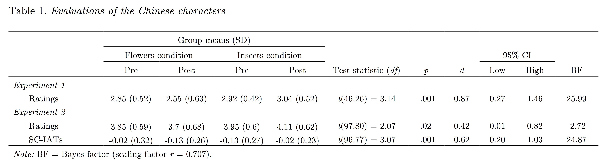

It seems safe to assume that psychological assessment adheres to Heisenberg’s observer effect in physics: by measuring, we perturb the system. This effect implies that the act of completing a psychological testing task simultaneously provides a training context for the organism. During the past two decades, the Implicit Association Test [IAT: @greenwald_measuring_1998] has become one of the most popular measurement tasks in psychology. Across three experiments, we examined a novel way in which the IAT might function as a training task. More specifically, we tested whether the IAT is an analogical evaluative learning task.

The IAT has seen wide use as an implicit measure of attitudes in many domains of psychological research, including clinical, social, and experimental psychology [@greenwald_understanding_2009]. The task requires individuals to quickly categorize stimuli as belonging to four superordinate categories that are presented on screen (e.g., pictures of flowers, pictures of insects, positive words, and negative words). Two categories are mapped to each response option (e.g., left response = flowers or positive, right response = insects or negative). Importantly, this mapping changes across blocks (e.g., left response = flowers or negative, right response = insects or positive). Importantly, participants of often observed to exhibit an IAT effect, whereby they show reaction time biases towards responding faster in one block of categorizations relative to the other. For example, faster performance is observed when pictures of flowers and positive words are assigned to one key and pictures of insects and negative words to the second key then when flower and negative are assigned to one key and insects and positive to the second key. Such differences in performance are assumed to reflect pre-existing differences in attitudes.

Whereas the IAT has most frequently been employed as a testing task, variants of the task have also been employed as a training task. For example, Ebert and colleagues (2009) demonstrated that completing an IAT-like categorization task induced evaluative learning (see Prestwich, Perugini, Hurling, & Richetin, 2010, for a related task). In one study, participants were asked to categorize candy, chocolate, and valenced words. When candy was mapped to the same response key as positive words and chocolate was mapped to the same response key as negative words, participants later evaluated candy as more positive than chocolate, and vice versa. It has been argued that this form of learning is one instance of learning via intersecting regularities (Hughes, De Houwer, & Perugini, 2016). Within the above example, the change in evaluation of candy versus chocolate was arguably driven by the intersection between the stimulus-response mappings that involve candy and positive (e.g., both required pressing a left key press) and those that involve chocolate and negative (e.g., both required a right key press). Such intersections have been shown to allow for a transfer of valence between the other members of the intersecting response mappings [@hughes_expanding_2016]. Importantly, however, research to date on the IAT as a training task has focused only on the effects of a single block of categorizations rather than the IAT as a whole.

We suggest that the IAT as a whole can function as a training task by specifying two relations and allowing the individual to use one relation to inform the nature of the other. That is, we believe that it allows for learning via analogy.  In order to understand what we are proposing here, it is important to realize that the IAT always includes two pairs of concepts. By definition, analogies are defined by the relating of relations between two pairs of concepts [@holyoak_surface_1987]. Specifically, analogical inferences can take place when there is one source relation and one recipient relation, and one of the concepts of the recipient relation is similar to one of the elements of the source relation. When these conditions are fulfilled, it becomes possible to form a link between the second element of the source relation and the second element of the recipient relation [@reisberg_analogical_2013]. We argue that the IAT fulfills these requirements by including two pairs of categories. Notionally, the relations between the target stimuli pair (e.g., positive and negative, which are opposites) could be taken as being indicative of the relation between the category stimuli pair (e.g., a positive category such as flowers, and an unknown novel category, such as Chinese characters), allowing the individual to construct an analogy (e.g., Chinese characters : flowers :: negative : positive). If so, it therefore should be possible to use the IAT to induce learning via analogy. This would have implications for the traditional use of the measure as a testing task within many clinical and social domains of psychology. Specifically, knowing whether, and to what degree, the IAT serves to establish or change the very attitudes it seeks to assess would seem to be an important caveat to the use of the IAT. It would also have implications for learning psychology research, by potentially providing a relatively subtle way to induce (evaluative) learning.

In three experiments, we assessed changes in liking due to the IAT. Participants evaluated neutral, unknown Chinese characters, completed a (training) IAT that differed between conditions, and then evaluated the characters a second time. The training IATs were based on the original flower-insects evaluation IATs [@greenwald_measuring_1998]. Each contained a novel stimulus target category (Chinese characters) as well as a valenced stimulus target category (either pictures of flowers or insects). Both tasks also employed positive and negative words as attribute stimuli. The flowers IAT therefore required participants to categorize Chinese characters, flowers, negative words, and positive words with response mappings that varied across the two blocks (e.g., press left for Chinese characters and negative and right for flowers and positive in one block versus press left for flowers and negative and right for Chinese characters and positive words in a second block). In contrast, the insects IAT required participants to categorize images of Chinese characters, images of insects, positive words, and negative words. Such IATs therefore share some similarities to those employed by @brendl_how_2001, who required participants to complete an IAT containing the categories insects, non-words, positive words and negative words, and subsequently rating the non-words. However, in the absence of pre-IAT ratings or a comparison condition (e.g., a flowers IAT), it is not possible to know from @brendl_how_2001's results whether ratings of the non-words were affected by the completion of the IAT.

Importantly, previous research on learning via IAT-like categorization tasks have always involved only one of the IAT’s block types [e.g., @ebert_how_2009]Prestwich et al., 2010) and would therefore likely not generalize to the full task. In contrast, our paradigm involves the full IAT including both block types. As such, this is the first study to our knowledge to examine the IAT as a training task. Furthermore, by involving both block types, our task did not directly train participants on the relation between Chinese characters and one type of valence stimuli. Because of this, it is difficult to account for any observed effects in terms of learning via intersecting regularities, or indeed in terms of other well-known learning effect such as classical or operant conditioning, given that the Chinese characters contained an equal number of intersections with both positive and negative stimuli [see @de_houwer_conceptual_2007; @de_houwer_what_2013].

Learning could, however, result on the basis of an analogy between pairs of categories. For instance, in the flowers IAT, participants could infer that Chinese characters relate to flowers as negative words relate to positive words. This analogy would imply that Chinese characters are opposite to flowers in terms of valence and thus that they are negative. Participants in the insects IAT, on the other hand, could infer that the Chinese characters are positive in valence. In sum, if the IAT can function as an analogical learning task, we expected more positive evaluations of the category “Chinese characters” when participants complete the insects IAT than when they complete the flowers IAT. For reasons that we will discuss at the end of this paper, observing these analogical learning effects would have interesting implications for both research on (learning via) analogy and research on the IAT as a measure of attitudes.

# Experiment 1

All tasks were programmed using PsychoPy (Peirce, 2007) or Inquisit (Inquisit 4, 2015) and presented on-screen. All materials for both experiments, including measures and R code for data processing and analyses and the pre-registration for Experiment 3 are available on the Open Science Framework (osf.io/t89fu). We report how we determined our sample size, all data exclusions (if any), all manipulations, and all measures in the study (Simmons, Nelson, & Simonsohn, 2012).

## Method

### Participants

Given the exploratory nature of the study, we recruited as many participants as possible within a pre-allocated data collection period of three weeks. Fifty-two students (37 women, 15 men, *M*~age~ = 22.06, *SD* = 3.46) at Ghent University were recruited and participated in the experiment in exchange for €5. All participants were fluent Dutch-speakers and provided written informed consent prior to participation. All instructions and tasks were provided in Dutch, although the English translations are reported here.

### Measures

Participants rated how much they liked each of the five Chinese characters and each of the five valenced images (flowers or insects, depending on condition). Each item employed a one (“not at all”) to five (“very much”) Likert scale.

For both IATs, the task parameters employed were identical to the archetype described by Nosek et al. (2007). Nonetheless, we provide a brief description of the task parameters here. Before each block, participants were instructed that they would be presented with words and pictures in the middle of the screen, that they were to categorize these using the labels presented at the top left and top right of the screen. Participants were furthermore instructed that these labels were mapped onto the left and right response keys (E and I, respectively). Prior to each block, participants were also alerted to which categories would be presented on the next block. On each trial, participants were required to emit a correct response in order to advance to the next trial; accuracy feedback was delivered via a red X.

Five images of each of flowers, insects, and different Chinese characters served as target stimuli. Five positive and five negative words served as attribute stimuli (attractive, enjoy, favorable, likeable, and lovely; awful, despise, dirty, disgust, and nasty). Two IATs were created: the flowers IAT (flowers, Chinese characters, positive, negative) and the insects IAT (insects, Chinese characters, positive, negative).

The length and content of each block was as follows (Nosek et al., 2007). Block 1: 20 attribute trials (i.e., positive and negative words); Block 2: 20 target trials (i.e., Chinese characters and either flowers or insects), Block 3: 20 target and attribute trials; Block 4: 40 target and attribute trials; Block 5: 40 attribute trials; Block 6: 20 target and attribute trials; and Block 7: 40 target and attribute trials. The location of the two target category labels reversed on Block 5, providing two contrasting categorization patterns across blocks. Comparisons were made between reaction times between stimulus presentation and correct response on Blocks 3 and 4 versus those on Blocks 6 and 7. The order of presentation of the blocks was also counterbalanced between participants so that half of participants first encountered a block in which Chinese characters and positive words were categorized using the same response key, and half first encountered a Chinese characters-negative words block.

### Procedure

Participants were tested in individual experimental cubicles, and were randomly assigned to the flowers condition or insects condition. All instructions were presented on the computer screen. The experimental sequence was as follows. First, participants rated the five Chinese characters (time-point “pre”), followed by condition-appropriate valenced images (flowers or insects). Second, they completed either the flowers IAT or insects IAT. Finally, they rated the Chinese characters and the valenced images a second time (time-point “post”).

## Results

### Data processing and analysis

Differences in reaction times for each participant between the IATs’ two response patterns (i.e., block 3 vs. 6 and 4 vs. 7) were quantified using the D1 scoring algorithm (Greenwald, Nosek, & Banaji, 2003). These were coded so that positive scores refer to more positive automatic evaluations of the Chinese characters. No exclusions were made based on overall accuracy within the test blocks (*M* = 92.8%, *SD* = 4.6) or latency performances (*M* = 659ms, *SD* = 92) in the test blocks (i.e., blocks 3, 4, 6 and 7). The ratings of the Chinese characters, flowers, and insects were each reduced to a mean score for each time-point and change scores were then calculated.

Given the directional nature of the manipulation checks and hypothesis we elected, a priori, to employ one-tailed comparisons in all t-tests while retaining an alpha value of .05. Two manipulation checks were performed. First, our analysis relies on the assumption that the flowers stimuli would be rated as more positive than the insect stimuli. A Welch’s independent t-test indicated that participants rated the flowers stimuli as more positive than the insects stimuli, *t*(50) = 14.52, p < 0.001, *d* = 4.02, 95% CI [3.03, 5.03]. Bayes factors (Rouder, Speckman, Sun, Morey, & Iverson, 2009) were also calculated using a default JZS prior probability. These included a Cauchy distributed prior on the effects size with scaling factor r = 0.707 for t-tests and r = 0.5 for ANOVAs. Following Jeffreys’ (1961) guidelines, this revealed extreme evidence that the data was more probable under the alternative hypothesis than under the null (BF+0 > 1000). Second, our analysis relies on the assumption that that D1 scores on the flowers and insects IATs would differ as a function of their valenced images. An independent t-test suggested that participants demonstrated larger D1 scores on the insects IAT than the flowers IAT, *t*(49.82) = -2.24, *p* = .015, *d* = 0.62, 95% CI [0.03, 1.20]. Bayes Factors revealed anecdotal evidence for the alternative hypothesis over the null (BF-0 = 4.08).

Most crucially, the change in liking of the Chinese characters due to the completion of the IAT was compared between groups using an independent t-test on the ratings change scores. This demonstrated significant differences of large effect size, *t*(46.26) = -3.14, *p* = .001, *d* = 0.87, 95% CI [0.27, 1.46]. Self-report ratings of the Chinese characters became more negative after the flowers IAT (M~change~ = -0.29, *SD* = 0.53) whereas ratings became more positive after the insects IAT (M~change~ = 0.12, *SD* = 0.40) . Bayes Factors revealed strong evidence for the alternative hypothesis over the null (BF-0 = 25.99). See Table 1 for summaries of the results of both experiments. See Figure 1 for plots of raw data, distributions, and inferential information. In sum, we observed an analogical learning effect.

Post hoc exploratory tests examined whether the effect was influenced by the order in which participants completed the IAT blocks (i.e., IAT block order). An ANOVA with ratings change scores entered as DV and condition and block order entered as IVs demonstrated no significant interaction between condition and block order, *F*(1, 48) = 0.03, *p* = .95, η2 < 0.01. Bayes Factors revealed anecdotal evidence for the alternative model containing the interaction over the null model (BF10 = 1.33).

# Experiment 2

In a second experiment, we sought to replicate and extend the effects observed in Experiment 1 under more stringent conditions. Several changes were made to the design and methods in order to attempt to increase the strength of the conclusions that could be drawn. First, evaluations of the Chinese characters were also assessed using the Single Category Implicit Association Test (SC-IAT: Karpinski & Steinman, 2006). The use of an implicit measure was intended to limit demand characteristics in the sample and to demonstrate that the evaluative learning effects have features of automaticity (e.g., can also be observed in a task that does not require the intention to evaluate the Chinese characters). The SC-IAT is a derivative of the IAT that includes only one target category (i.e., Chinese characters) and the two attribute categories (i.e., positive and negative). Second, the self-report ratings of the valenced images were taken at the end of the experiment rather than both before and after the IAT. In this manner, the only task in which the participants encountered the valenced images was the IAT, thus limiting the potential for unintended learning contexts within the procedure (e.g., tacit contrasting of the Chinese characters and valenced images within the rating scales). Third, in order to establish that the symbols were of unknown meaning, participants were asked if they understood any of the Chinese symbols at the start of the experiment. Finally, the ratings scales were changed from a 1 to 5 scale to a 1 to 7 scale to allow for greater variance. Similar to Experiment 1, it was hypothesized that the Chinese characters would acquire the opposite valence to the target category that they were contrasted with in the IAT, on both the self-report and implicit measures.

## Method

Participants. In contrast to Experiment 1, the sample size of *N* = 100 was determined by an a priori power analysis. This sample could be expected to provide sufficient power to detect change score groups differences of medium effect size (given α = .05, 1-β = .80, *d* = 0.5; *N* ≥ 98). 104 students (79 women and 25 men, *M*~age~ = 21.51, *SD* = 3.24) took part in exchange for €5. All participants were fluent Dutch-speakers and provided written informed consent prior to participation. Four participants provided only partial data and were excluded.

## Measures

Understanding of the Chinese characters was assessed using a single item that asked the participant whether they understood any or all characters using a yes/no response format. Similar to Experiment 1, participants rated the Chinese characters and the valenced images, this time using a 1-7 point scale. The IATs were identical to Experiment 1. The SC-IAT was employed to assess automatic evaluations of the Chinese characters in the absence of a valenced image contrast category. Similar to the IAT, the SC-IAT presented stimuli in the middle of the screen and required participants to categorize them in line with category labels that were presented at the top of the screen. These labels were mapped onto the left and right response keys (E and I). The SC-IATs consisted of 3 blocks. Participants first completed a practice block of 20 trials that presented the two attribute category stimuli only (i.e., positive and negative words) followed by two test blocks that presented both target (Chinese characters) and attribute stimuli (valenced words). Whereas the IAT typically presents equal numbers of trials for each stimulus categories on each test block, the SC-IAT presented an unequal number in order to roughly to balance the number of trials requiring left and right key responses while employing only three stimulus categories. Specifically, one test block presented 20 Chinese characters trials, 20 positive words trials, and 30 negative words trials; the other test block presented 20 Chinese characters trials, 30 positive words trials, and 20 negative words trials. Progression to the next trial was contingent on providing a correct response, and accuracy feedback was presented via a red X on incorrect trials. Brief explanatory instructions identical to the IAT were presented to the participant before each block. Block order presentation of both the IAT and SC-IATs was counterbalanced between participants.

## Procedure

Participants were tested individually in experimental cubicles, and were randomly assigned to the flowers condition or insects condition. All instructions were presented on the computer screen. The experimental sequence was as follows: participants completed the Chinese characters recognition scales, the SC-IAT, and rated the Chinese characters (but not the valenced images). Time-point for this SC-IAT and rating scales was thus “pre” the IAT. Participants then completed either the flowers IAT or insects IAT, and then the rating scales and SC-IAT a second time. Time-point for this SC-IAT and rating scales was thus “post” the IAT. Finally, each participant was asked to rate both the flowers and insects stimuli.

## Results

All participants responded on the recognition test that they did not understand any of the Chinese characters. As such, no exclusions were made on the basis of this criterion. Identical to Experiment 1, ratings of the 5 exemplars of the characters, the images of flowers and the images of insects, respectively, were reduced to one mean score for each. Reaction times and accuracies on the IATs’ test blocks (i.e., blocks 3 vs. 6 and 4 vs. 7) were each transformed to a single D1 score for each participant. Responses on the SC-IATs’ test blocks (i.e., blocks 2 vs. 3) were also used to calculate a D1 score for each SC-IAT. Finally, change scores were calculated. Both the IAT and the SC-IATs were coded so that positive scores refer to more positive evaluations of the Chinese characters (i.e., IATs: Chinese characters-positive/flowers-negative or Chinese characters-positive/insects-negative effects respectively; SC-IATs: Chinese characters-positive/negative effects). No exclusions were made based on accuracy (M~SC-IATpre~ = 94.6%, *SD* = 3.6; M~IAT~ = 93.5%, *SD* = 4.9; M~SC-IATpost~ = 92.9%, *SD* = 4.7) or latency performances (M~SC-IATpre~ = 642ms, *SD* = 108; M~IAT~ = 669ms, *SD* = 98; M~SC-IATpost~ = 622ms, *SD* = 79) in the test blocks of either the IAT or SC-IATs.

As in Experiment 1, given the directional nature of the manipulation checks and hypotheses we elected, a priori, to employ one-tailed comparisons in all tests (while retaining an α value of .05). Similar to Experiment 1, two manipulation checks were tested. A dependent t-test suggested that participants rated the flowers stimuli as more positive than the insects stimuli, *t*(99) = 26.91, p < 0.001, *d* = 4.08, 95% CI [3.59, 4.58]. Bayes Factors revealed extreme evidence for the alternative hypothesis over the null (BF+0 > 1000). An independent t-test demonstrated larger IAT D1 scores on the insects IAT than the flowers IAT, *t*(97.53) = - 4.11, p < .001, *d* = 0.82, 95% CI [0.40, 1.24]. Bayes Factors revealed anecdotal evidence for the alternative hypothesis over the null (BF-0 = 484).

Changes in self-reported liking of the Chinese characters due to the completion of the IAT were compared between groups using an independent t-test on the ratings change scores. This demonstrated significant differences of medium effect size, *t*(97.70) = -2.07, *p* = .02, *d* = 0.42, 95% CI [0.01, 0.82]. Self-report ratings of the Chinese characters became more negative after the flowers IAT (M~change~ = -0.15, *SD* = 0.72) whereas ratings became more positive after the insects IAT (M~change~ = 0.15, *SD* = 0.74). Bayes factors revealed anecdotal evidence for the alternative hypothesis over the null (BF-0 = 2.72).

Differential changes in automatic evaluations of the Chinese characters due to the completion of the IAT between the two groups were assessed using an independent t-test on the SC-IAT change scores. This demonstrated significant differences of medium effect size, *t*(96.77) = -3.07, *p* = .001, *d* = 0.61, 95% CI [0.20, 1.03]. Automatic evaluations of the Chinese characters on the SC-IATs became more negative after the flowers IAT (M~change~ = -0.10, *SD* = 0.35) whereas ratings became more positive after the insects IAT (M~change~ = 0.11, *SD* = 0.33). Bayes factors revealed strong evidence that the observed data was more probable under the alternative hypothesis than under the null (BF-0 = 24.87).

Post hoc exploratory tests examined whether the effect was influenced by the order in which participants completed the IAT blocks (i.e., IAT block order). First, an ANOVA with ratings change scores entered as DV and condition and IAT block order entered as IVs demonstrated no significant interaction between condition and block order, *F*(1, 96) = 0.14, *p* = .71, η2 < 0.01. Bayes Factors revealed strong evidence for the null model over the alternative model containing the interaction (BF10 = 0.08). A second ANOVA was conducted with SCI-IAT change scores entered as DV and condition and IAT block order entered as IVs. This demonstrated no significant interaction between condition and block order, *F*(1, 96) = 1.85, *p* = .18, η2 = 0.02. Bayes Factors revealed anecdotal evidence for the alternative model containing the interaction over the null (BF10 = 1.60).

Post hoc exploratory tests were again used to examine whether the learning effect was influenced by the IAT order. First, a mixed-effects ANOVA was conducted with ratings change scores entered as DV, condition and IAT block order entered as fixed factor IVs, and experiment entered as a random factor IV. This demonstrated no significant interaction between condition and IAT block order, *F*(1, 147.02) = 0.08, *p* = .78. Bayes Factors revealed anecdotal evidence for the alternative model containing the interaction over the null model (BF10 = 1.74).

# Experiment 3

In a third experiment, we sought to explore the analogical nature of the IAT’s learning effect and distinguish it from being a form of contrast effect (Scherer & Lambert, 2009; Sherman, Ahlm, Berman, & Lynn, 1978). If the effect is analogical, it would necessarily involve not only the Chinese characters and the valenced contrast category (flowers or insects) but also a second pair of stimuli, such as the attribute categories (e.g., positive and negative words). This experiment therefore manipulated the relation between the attribute categories in order to observe whether this undermined the IAT’s learning effect. One condition completed an “opposite attributes” IAT that used positive and negative words as attribute stimuli, as in the previous experiments. This was intended to invite a relatively stronger analogy among the four categories: “Chinese characters:insects::positive:negative”. A second condition completed a “non-opposite attributes” IAT that employed non-words as attribute stimuli (e.g., Niffites vs. Luupites). This was intended to invite a relatively weaker analogy among the categories: “Chinese characters:insects::Niffites:Luupites”.

We had two hypotheses. First, we attempted to replicate the learning effect observed in the previous experiments. Identical to the previous study, it was hypothesized that, in the opposite attributes condition, the Chinese characters would acquire the opposite valence to the target category that they were contrasted with in the IAT on both the self-report ratings and implicit measure (SC-IAT). Second, we explored whether this learning effect was weaker in the non-opposite attributes condition, where the analogy among the four categories was undermined. In order to increase the evidential weight of the data, the design, sample size, inclusion/exclusion criteria, and analytic strategy for this study was pre-registered.

## Method

Participants. Sample size was determined a priori, but no power analysis was conducted due to the difficult of estimating power for linear mixed-effects models. As we expected a relatively small effect between the opposite attributes and non-opposite attributes conditions, we employed a relatively large sample size. In contrast to the previous studies, we collected data online from the prolific.ac platform: 449 individuals (223 women, 222 men, and 4 who identified as a third category, *M*~age~ = 34.90, *SD* = 11.45) took part in exchange for £0.90. All participants provided informed consent prior to participation. More stringent inclusion criteria were used relative to the previous experiments given the use of online data collection. Inclusion criteria were 90% approval rate in previous studies on the platform, age 18-65, English as a first language, and no participation in previous studies by our research group. Exclusion criteria were incomplete data, >10% of reaction times < 300ms on the IAT's test blocks (blocks 3, 4, 6, 7). Twenty-two individuals were excluded on this basis. Whereas the previous experiments also employed an accuracy exclusion criterion, none were applied in the current study on the basis that the non-opposite attributes IAT, which included non-words, was of unknown difficulty relative to more typical IATs.

## Measures

Measures were highly similar to the previous experiment but were presented in English rather than Dutch. Two additional versions of the training IAT were created. These replaced the positive and negative attribute stimuli and their category labels with categories of non-words (Niffites: cellanif, eskannif, lebunnif, zallanif, otrannif, borrinif; vs. Luupites: meesolup, neenolup, omellup, wenalup, turralup, loomalup). These non-words have been employed as neutral stimuli in previous evaluative learning studies (Van Dessel, De Houwer, Gast, & Smith, 2015). Four versions of the IAT were therefore used in a 2X2 between-groups factorial design: (1) flowers IAT with opposite attributes, (2) insects IAT with opposite attributes, (3) flowers IAT with non-opposite attributes, and (4) insects IAT with non-opposite attributes.
Procedure. Participants completed one random training IAT, followed by the Chinese characters SC-IAT and ratings scales. Unlike the previous experiments, participants were not asked to evaluate the stimuli before completing the IAT. This change was made on the basis that previous evaluative learning research has demonstrated that requiring participants to evaluate stimuli at multiple time-points can interfere with learning effects under some circumstances (Gawronski, Gast, & Houwer, 2015). The order of the SC-IAT and ratings scales was counterbalanced between participants, as was the SC-IAT block-order.

## Results

### Analytic strategy

We expected any evaluative learning effect to be small and therefore chose to employ a more powerful analytic strategy. While D scoring of (SC-)IAT data is common, it reduces each individual’s performance on the task down to a single score. In contrast, by examining reaction time data directly, we were able to make use of all 140 reaction times provided by each participant’s SC-IAT test blocks, thereby increasing power. Of course, this increase in power must be balanced with two functions usually accomplished with D scoring: (1) an acknowledgement of the non-independence of the multiple reaction times produced by each participant, and (2) controlling for differences in general responding speed between participants. Both points were addressed by using linear mixed-effects models, which allow for the modeling of both experimentally manipulated fixed effects (e.g., SC-IAT block, IAT contrast category condition, IAT attribute condition) and also sources of unknown variation due to random effects (e.g., general responding speed; Baayen, Davidson, & Bates, 2008; Bates, Mächler, Bolker, & Walker, 2015). For the sake of clarity and simplicity, only frequentist linear mixed-effects models were run and will be reported here, and only the results of effects that test specific hypotheses will be reported here. Details of other fixed main and interaction effects and random effects can be found in the supplementary materials on the OSF. All steps in this analytic strategy were pre-registered, and any diverges from the pre-registration are noted or described as exploratory. In all models, confidence intervals and p values were approximated using the Wald method, which has been shown to be acceptable for larger samples such as ours (Luke, 2016).

Data from the SC-IATs’ test blocks (i.e., blocks 3 vs. 4) was first processed to remove outliers and increase normality. Reaction times < 300 ms were trimmed and then reciprocally transformed to increase normality (Ratcliff, 1993; Whelan, 2008). It should be noted that reciprocal of reaction time can be referred to as “speed” (i.e., responses per second vs. seconds per response). Reciprocal transformations therefore have greater interpretability than other transformations (e.g., log). For example, participants may equally be described as having either “lower reaction times” or “higher speed” in one SC-IAT block relative to the other. Outliers were defined as >2.5 SD from the mean and excluded. 1.74% of data points were excluded on this basis. No transformations or exclusions were applied to the ratings data. Data were then submitted to a series of linear mixed-effects models.

### Automatic evaluations

We began by assessing whether the evaluative learning effect observed on the SC-IAT in the previous experiments was replicated. This was done using only data from the opposite attributes conditions. In the context of our mixed model, this referred to differences in responding speed being predicted by the interaction between the IAT conditions (whether Chinese characters were contrasted with flowers vs. insects) and the SC-IAT effect (differences between the SC-IAT blocks). In order to control for differences in general responding speed and acknowledge the non-independence of the reaction times generated by each participant, we included a random slope intercept for participant. Finally, in order to model differences in the magnitude of the SC-IAT effect even between individuals in the same condition, we allowed for a random slope for SC-IAT block. The inclusion of this random slope, which is not directly required to test the hypotheses, makes this a relatively conservative approach (Barr, Levy, Scheepers, & Tily, 2013). This model can be specified more precisely using Wilkinson notation:

`speed ∼ SCIATblock * IATcontrastcondition + (SCIATblock | participant)`

Hypothesis 1, that the IAT contrast category influences automatic evaluations on the SC-IAT, referred to the two-way interaction between SC-IAT block and IAT contrast condition. The expected interaction effect was found (*B* = 0.016, 95% CI = [0.007, 0.024], β = 0.034, 95% CI = [0.016, 0.052], *p* = .0003). Inspection of the estimated marginal means demonstrated that the effect was in the expected direction: when participants had previously completed the flowers IAT, they were faster (had higher speed) when categorizing Chinese characters using the same key as negative words (*M* = 1.71, 95% CI = [1.67, 1.75]) relative to positive words (*M* = 1.69, 95% CI = [1.65, 1.72]); whereas, when they had previously completed the insects IAT, they were faster to categorize Chinese characters using the same key as positive words (*M* = 1.72, 95% CI = [1.68, 1.77]) relative to negative words (*M* = 1.69, 95% CI = [1.64, 1.73]). Results therefore suggest that the Chinese characters acquired the opposite valence to the images they were contrasted with in the IAT, thus replicating the evaluative learning effect found in the previous experiments.

Next, we assessed the corollary of hypothesis 1: that the evaluative learning effect should be absent when employing non-word attribute stimuli. First, we examined data from only the non-opposite attributes condition, where we attempted to undermine the structural analogy within the IAT by employing non-words as attribute stimuli. The same mixed model specification was employed as the previous analysis. Our exploratory hypothesis here, which was not included in the pre-registration, was that no two-way interaction effect should be observed in the non-opposite attributes condition. The interaction effect was non-significant, as expected (*B* = 0.005, 95% CI = [-0.003, 0.013], β = 0.011, 95% CI = [-0.007, 0.029], *p* = .23). Inspection of the estimated marginal means demonstrated that participants responded with comparable speed in the two conditions (flowers IAT condition: Chinese characters-negative block, *M* = 1.69, 95% CI = [1.65, 1.73], Chinese characters-positive block, *M* = 1.68, 95% CI = [1.64, 1.72]; insects IAT condition: Chinese characters-negative block, *M* = 1.67, 95% CI = [1.63, 1.7], Chinese characters-positive block, *M* = 1.67, 95% CI = [1.63, 1.71]). Results therefore provide no evidence for the evaluative learning effect when the IAT’s structural analogy was undermined.

The previous analyses suggest that there was evidence for the effect in the opposite attributes condition and no evidence for the effect in the non-opposites condition. However, in order to directly test hypothesis 2, that the evaluative learning effect is undermined when attribute stimuli were non-opposites relative to opposites, these two conditions should be directly compared. A third model was created using data from both the IAT attribute conditions were used, and entering this condition into the model:

`speed ∼ SCIATblock * IATcontrastcondition * IATattributeconditions + (SCIATblock | participant)`

Hypothesis 2 refers to the three-way interaction between SC-IAT block, IAT contrast condition, and IAT attributes condition. A marginally significant interaction effect was found (*B* = -0.005, 95% CI = [-0.011, 0.001], β = -0.012, 95% CI = [-0.024, 0.001], *p* = .07). Inspection of the marginal means (above) indicated that this effect was in the expected direction. Given this marginal effect, we then constructed an additional, less conservative, exploratory model that removed the random slope for SC-IAT block. This model therefore focused on assessing group differences in the SC-IAT effect and did not attempt to model differences in the SC-IAT effect at the individual level. Using this model, a significant three-way interaction effect was found (*B* = -0.005, 95% CI = [-0.009, -0.002], β = -0.012, 95% CI = [-0.019, -0.005], *p* = .001).

### Self-reported evaluations

A comparable set of models was used to assess the same hypotheses within the self-report ratings. These each included a random intercept for participant to acknowledge the non-independence of the multiple ratings produced by each participant. Data from the opposite attributes IAT conditions was used to assess Hypothesis 1, that the IAT contrast category influences the explicit evaluations. No significant main effect for IAT contrast condition was found (*B* = -0.097, 95% CI = [-0.215, 0.022], β = -0.088, 95% CI = [-0.196, 0.020], *p* = .11). Participants rated the Chinese characters similarly whether they previously completed the flowers IAT (*M* = 4.23, 95% CI = [4.07, 4.39]) or insects IAT (*M* = 4.42, 95% CI = [4.25, 4.59]). Results therefore do not replicate those found in the previous experiments: no evaluative learning effect was found on the self-report measures. An exploratory analysis of data from the non-opposite attributes conditions revealed no evidence that ratings differed between the IAT contrast category conditions (*B* = -0.075, 95% CI = [-0.184, 0.033], β = -0.068, 95% CI = [-0.166, 0.030], *p* = .17). Participants therefore rated the Chinese characters similarly whether they previously completed the flowers IAT (*M* = 4.24, 95% CI = [4.08, 4.4]) or insects IAT (*M* = 4.39, 95% CI = [4.24, 4.54]).

Hypothesis 2 was tested directly by considering data from both IAT attribute conditions together, and including the interaction between IAT contrast category and IAT attributes in the model. No evidence was found for an interaction effect between IAT contrast category and IAT attributes was found (*B* = 0.011, 95% CI = [-0.069, 0.091], β = -0.010, 95% CI = [-0.063, 0.082], *p* = .79).

# General discussion

Results from three experiments demonstrate that the IAT functions as an evaluative learning context and does so in a previously unappreciated manner. Changes in liking of the Chinese characters as a result of being contrasted with valenced images in the IAT were observed in all three experiments. This effect was found on both self-report ratings (Experiments 1 and 2, but not found in Experiment 3) and an implicit measure (Experiments 2 and 3, no implicit measure included in Experiment 1). Importantly, and in line with the hypotheses, the Chinese characters acquired the opposite valence to that of the target category they were contrasted with in the IATs.

## The analogical nature of the effect

All three experiments provide evidence for an evaluative learning effect, with consistent results on the implicit measures and more mixed results on the self-report measures. However, the nature of the effect requires consideration. Importantly, the procedural set-up of the IAT, and the fact that the Chinese characters acquired the opposite rather than same valence to the stimulus they were contrasted with makes the effect very difficult to explain as an instance of learning via established environmental regularities, such as stimulus pairing or intersecting regularities. If the effect were due to stimulus pairing (i.e., an evaluative conditioning effect), we would expect to observe the Chinese characters to acquire the same valence to the images they are contrasted with, whereas in fact they acquired the opposite valence. Comparably, if the effect is also difficult to see as an instance of intersecting contingencies (De Houwer et al., 2013; Hughes et al., 2016), given that the contingencies involving Chinese characters (a) intersected an equal number of times with contingencies involving the positive and negative attribute stimuli, and (b) never intersected with the contingencies involving the valenced images (flowers or insects).

In the absence of an explanation for the learning effect in terms of established regularities, Experiment 3 sought to distinguish between to two possible accounts for the effect. On the one hand, if it were best described as a contrast effect, this would imply that it involves only the relating of the neutral category (Chinese characters) and valenced contrast category (flowers or insects) as opposites (i.e., Chinese characters:insects; see Scherer & Lambert, 2009; Sherman et al., 1978). On the other hand, if the effect were best described as analogical, it would necessarily involve (a) a second pair of stimuli and (b) the relating of relations among these two pairs (Gentner & Smith, 2013). Within the context of the IAT, the Chinese characters and valenced contrast category (flowers or insects) could notionally form the target pair, and the attribute categories (positive vs. negative words) could form a source pair. If the effect were analogical, the relation between the source pair (the attribute categories) would serve to cue the relation between the target pair (the neutral category and valenced contrast category). That is, the fact that the attribute words are a pair of opposites may signal that the Chinese characters are also opposite to the contrast category (e.g., Chinese characters:insects::positive:negative). Experiment 3 therefore manipulated the relation between the attribute categories between groups in order to observe whether this influenced the learning effect. Results demonstrated evidence for the learning effect in the condition that employed opposite attributes (positive vs. negative words), whereas no evidence was found for the learning effect in the condition that employed non-opposite attribute stimuli (non-words: Niffites vs. Luupites). The difference between these two conditions was marginally significant in the more conservative, pre-registered linear mixed-effects model, although it should be noted that it was highly significant in a less conservative, exploratory model that relaxed the assumptions about the random effects. As the effect appeared to be influenced by the relational among the attribute stimuli and not merely the Chinese characters and contrast category, we therefore concluded that there is at least initial evidence that the IAT’s learning effect can be characterized as being analogical. Our data therefore suggests that the IAT can function as an analogical learning task. This has several implications for both learning research and for the use of the IAT, which will be discussed further below. Future research may wish to examine what other properties of the task are necessary to the creation of an analogical learning effect. For example, whether the mere presentation of pairs of pairs is enough to induce analogical learning, or whether the key responses participate in the effect.
While our results refer specifically to learning via the IAT, it is likely that other tasks might induce a comparable effect. For example, Scherer and Lambert (2009) demonstrated that relatively neutral images presented within an evaluative priming task are evaluated within the task as either positive or negative depending on whether they are presented alongside positively or negatively valenced images. While the authors describe their results as a contrast effect (i.e., due to the contrasting of a valenced stimulus and a neutral stimulus), it is equally possible that these effects are actually instances of an analogical effect like that described here. Like the IAT, the evaluative priming task includes not only the neutral and valenced stimulus categories, but also a second pair or valenced attribute categories. This could be investigated in a similar manner as in Experiment 3 within the current article, by manipulating the relation among the attribute categories. Future research might therefore wish to explore whether other tasks, such as evaluative priming, also demonstrate contain structural analogies and can be used to demonstrate analogical learning effects (see also Spellman, Holyoak, & Morrison, 2001).

## Implications for learning

Results are of interest to learning psychology, as they demonstrate that IAT may have utility as a task for inducing learning via analogy. Importantly, research to date on analogy has predominantly focused on the mechanisms of analogical reasoning (e.g., the ability to generate a correct answer given an incomplete analogy: Gentner, 1989; Holyoak & Thagard, 1989) and on how analogical abilities are involved in the development of language (Christie & Gentner, 2014; Gentner & Christie, 2008; Gentner & Namy, 2006). However, relatively less work has focused on learning via analogy, when learning is defined as a change in behavior due to regularities in the environment (De Houwer et al., 2013; although see Bliznashki & Kokinov, 2009; Gentner & Smith, 2013; Ruiz & Luciano, 2011; Stewart, Barnes-Holmes, Hayes, & Lipkens, 2001). This is surprising given that several authors have argued that analogy is central to human adaptability to our environment and our ability to learn about events we have not directly experienced (e.g., Gentner, 2003; Hofstadter, 2001; Holyoak & Thagard, 1995). We therefore suggest that there is a need to directly examine learning about novel concepts via such analogical abilities, including study of the environmental regularities that determine when analogical learning takes place. We suggest that this concept of learning via analogy may have both explanatory and predictive utility. For example, while our observed effects here are not easily interpreted as being due to established environmental regularities, such as stimulus pairing, operant learning, or intersecting regularities (Hughes et al., 2016), they are readily accommodated as instances of learning via analogy. Furthermore, the concept of learning via analogy allows for future predictions about how to arrange the environment to produce such learning. Learning psychology and behaviour change research may therefore benefit from closer consideration of learning via analogy (see also De Houwer, Hughes, & Barnes-Holmes, 2016). In a broader sense, this may contribute to efforts to bridge our understanding of (evaluative) learning and attitude change between traditionally disparate fields of study, such as evaluative conditioning, instructional control, and persuasion (De Houwer & Hughes, 2016).

It is also worth noting that analogy research to date most frequently has used explicit tasks, insofar as participants are explicitly asked to select logically correct responses in order to complete analogies. These include, for example, analogy completion tasks (e.g., “start : finish :: far : [near, away, travel, farther]”, Sternberg & Nigro, 1980) and relational matching-to-sample tasks (e.g., where individuals can respond to the compound stimulus “square-square” [same] with the compound stimulus “triangle-triangle” [same] or “circle-star” [different]; Christie & Gentner, 2014; Premack, 1983). Our use of the IAT here, in contrast, is a relatively subtle way of arranging the environment so as to allow the participant themselves to construct and employ analogies by making analogical responding task-irrelevant. It may be the case that this induces less reactance in participants (i.e., resistance against the experimental manipulation: Fulcher & Hammerl, 2005) than explicit instructions to learn via analogy. This property of making analogical responding a task-irrelevant goal within the IAT may therefore allow for several new areas of research, such as research into the automaticity of learning via analogy or the automaticity of the deployment of analogical abilities.

## Implications for the IAT

In line with Heisenberg’s observer effect in physics, our results suggest that the act of completing an IAT to some extent establishes or changes the attitudes that it is intended to assess. This may have important implications for its use as a measure of implicit attitudes: consider a race IAT in which participants categorizes faces of Black people, White people, positive words, and negative words (e.g., Greenwald et al., 1998, 2009). Existing research suggests that completing such an IAT may influence subsequent behaviour towards racial out-groups (Vorauer, 2012), but has not provided a precise account of how the IAT induces learning, and therefore how this effect could be enhanced or mitigated. The current results suggest that, for example, if prior to completing a race IAT a white individual possessed (a) strong automatic positive evaluations of white people but (b) no particularly strong automatic evaluations of black people, the act of completing the IAT may serve to establish the analogy that “black people are to white people as negative is to positive” (i.e., two pairs of opposites). Such an individual might subsequently evaluate black people more negatively after completing the task. Future research should therefore examine whether analogical learning within the IAT biases its outcome, or even changes the established attitudes it intends to assess. For example, one could test whether completion of a race IAT serve to increase racial bias, and how lasting any such changes may be (cf. Lai et al., 2016).

Two limitations of the current research must be acknowledged. On reflection, given the procedural similarity between the IAT and SC-IAT, the use of a SC-IAT as an outcome measure in Experiments 2 and 3 may have influenced the observed learning effects in some way. Future research may therefore wish to employ an assessment task whose procedural properties are more distinct from the IAT, such as evaluative priming (e.g., Spruyt & Tibboel, 2015) or the Affective Misattribution Task (Payne, Cheng, Govorun, & Stewart, 2005). Finally, future studies may wish to directly address the question of whether the IAT block order influences the learning effects, for example, by facilitating or interfering with the structural analogy among the stimuli.

Results from three experiments demonstrated that the IAT functions as a training task as well as a testing task, and does so in a previously unrecognized manner. More specifically, results suggest that the IAT can function as an analogical learning task. Our results reveal new avenues for research on both learning via analogy and the IAT as a measure of attitudes.

# References
